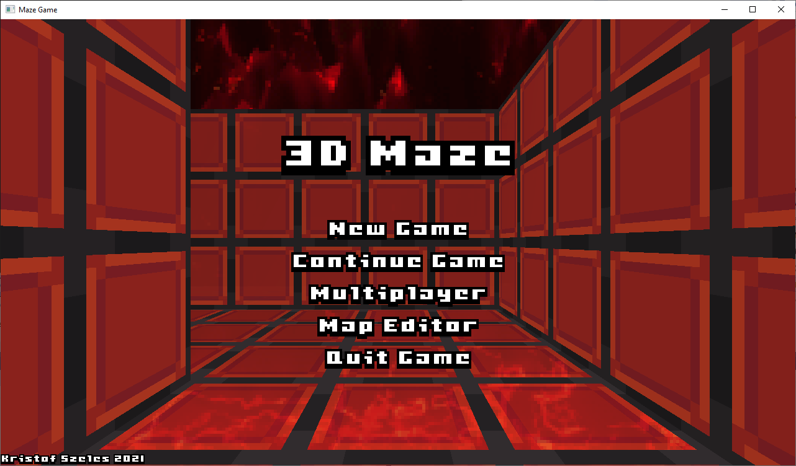
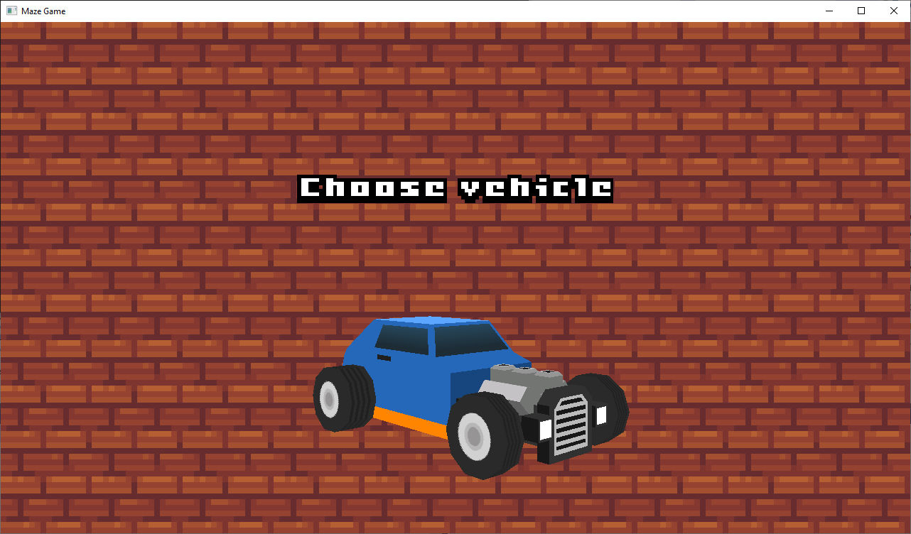
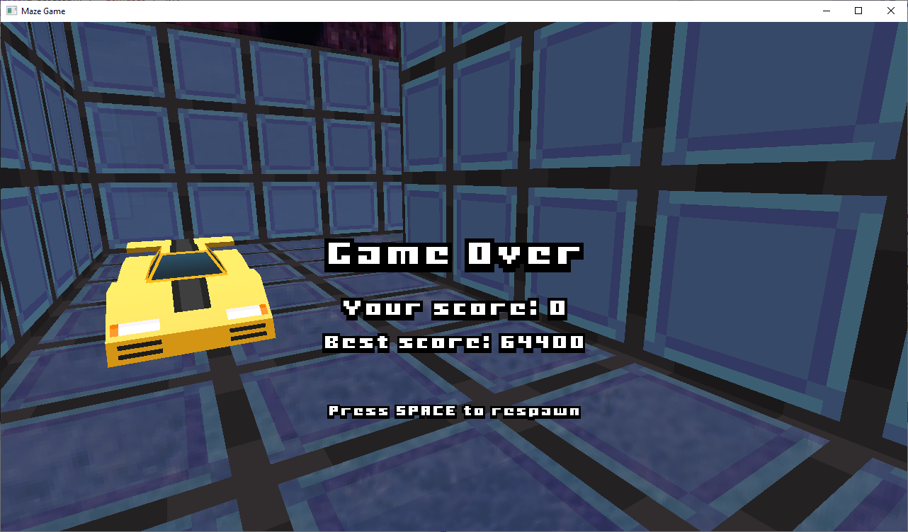
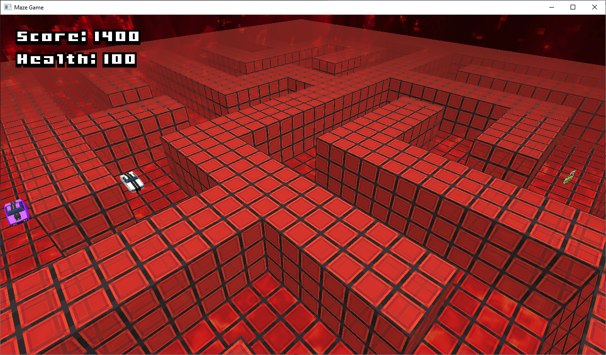
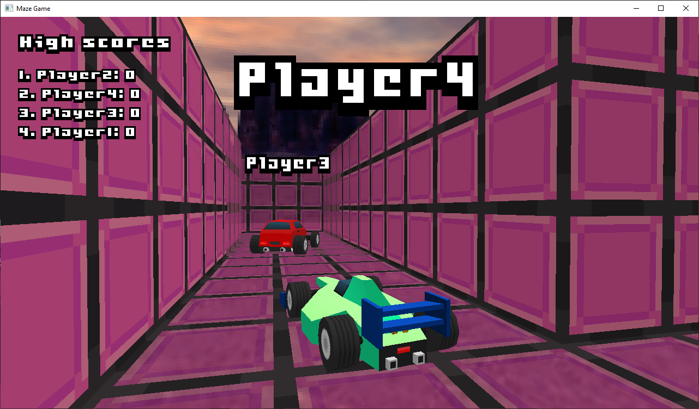
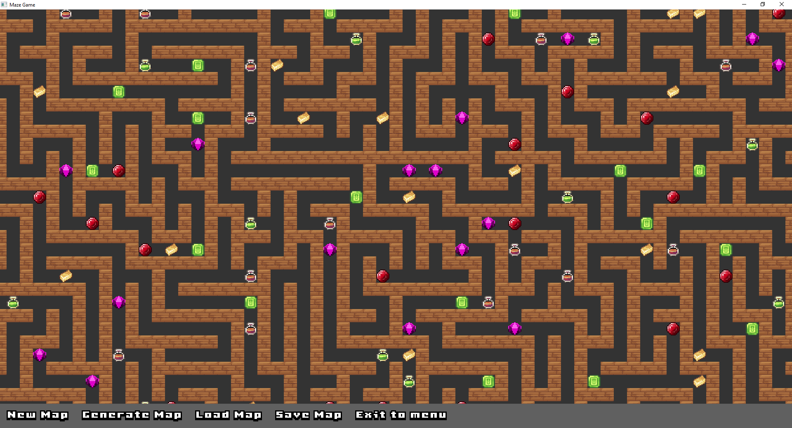
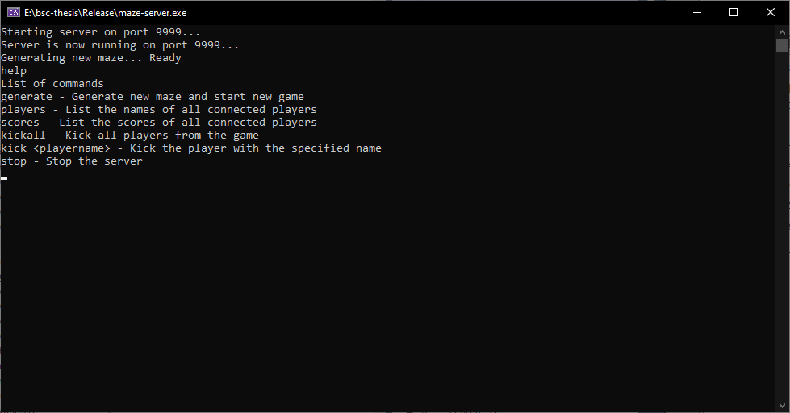
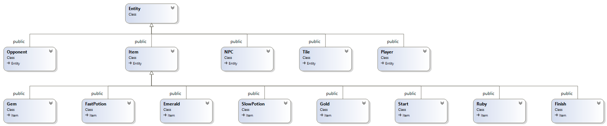

# Multiplayer 3D Maze Game in OpenGL

This project was written by Kristóf Széles as a BSc thesis at Eötvös Loránd University (ELTE) Faculty of Informatics under the supervision of Norbert Pataki in 2021. It is a first-person 3D maze game built from scratch in **C++20** using **OpenGL** and **SDL2**. Players navigate randomly generated labyrinths, collect treasures, avoid NPC vehicles, and compete with others in real-time multiplayer over TCP.



The main menu features a live demo mode in the background where the camera automatically walks through a generated maze, giving an immediate feel for the gameplay.

---

## Table of Contents

- [Features](#features)
- [Quick Start](#quick-start)
- [System Requirements](#system-requirements)
- [Game Configuration](#game-configuration)
- [Gameplay Guide](#gameplay-guide)
  - [Controls](#controls)
  - [Single Player](#single-player)
  - [Items and Potions](#items-and-potions)
  - [Multiplayer](#multiplayer)
  - [Map Editor](#map-editor)
- [Server Setup](#server-setup)
  - [How It Works](#how-it-works)
  - [Server Configuration](#server-configuration)
  - [Server Commands](#server-commands)
  - [Multiplayer Setup Guide](#multiplayer-setup-guide)
- [Architecture Overview](#architecture-overview)
- [Testing](#testing)
- [License](#license)

---

## Features

- **3D first-person rendering** with OpenGL shaders, distance-based fog, and skybox environments
- **Procedural maze generation** using a depth-first search algorithm with backtracking
- **Single player mode** with three difficulty levels, NPC enemies, collectible treasures, and potions
- **Multiplayer mode** with real-time TCP networking, leaderboard, and in-game chat
- **Built-in map editor** for creating custom maps in a 2D painting interface
- **Multithreaded game server** with admin console commands and anti-cheat detection
- **Configurable** via JSON files for both client and server
- **Cross-platform** support for Windows, Linux, and macOS
- **40+ selectable vehicles** with 3D models
- **Multiple skybox and wall textures** for visual variety

---

## Quick Start

### 1. Build both projects

**Windows** &mdash; Open `bsc-thesis.sln` in Visual Studio 2019 (or later) with the **Desktop development with C++** workload. Select the desired project and build in Release mode.

**Linux (Debian/Ubuntu)** &mdash; Install dependencies and run the build scripts:

```bash
# Install build dependencies
sudo apt update
sudo apt install g++-10 libsdl2-dev libsdl2-image-dev libsdl2-net-dev \
    libgtk-3-dev libglm-dev libglew-dev libglu1-mesa-dev zlib1g-dev

# Install runtime dependencies (if not already pulled in)
sudo apt install libsdl2-2.0-0 libsdl2-image-2.0-0 libsdl2-net-2.0-0 libglew2.1

# Build the server
cd maze-server && sh build-linux.sh && cd ..

# Build the game
cd maze-game && sh build-linux.sh && cd ..
```

> **Note:** The game build scripts link against `-lnfd` from a local `lib/` directory. You may need to build the [Native File Dialog](https://github.com/mlabbe/nativefiledialog) library and place it in `maze-game/lib/`, or adjust the linker flags for your system.

**macOS** &mdash; Install [Homebrew](https://brew.sh/) if you do not have it, then install the toolchain and libraries and run the macOS build scripts:

```bash
# Apple Clang and build tools (skip if already installed)
xcode-select --install

# Dependencies: SDL2, networking, image loading, OpenGL extension loader, pkg-config, CMake
# (Homebrew's sdl2 is sdl2-compat, an SDL2 shim that loads sdl3 at runtime, so it's required too)
brew install cmake pkgconf sdl2 sdl2_image sdl2_net sdl3 glew

# Build the server
cd maze-server && sh build-macos.sh && cd ..

# Build the game (first run clones and builds nativefiledialog-extended; requires git and network)
cd maze-game && sh build-macos.sh && cd ..
```

The game uses headers and libraries from Homebrew for SDL2 and GLEW (the copies under `maze-game/include` that target Windows are not used for this build). On the first `build-macos.sh` run, [nativefiledialog-extended](https://github.com/btzy/nativefiledialog-extended) is fetched into `maze-game/build/` and built to `maze-game/build/nfd/libnfd.a`. GTK is not required on macOS.

### 2. Play single player

Run `maze-game` from the `maze-game` directory (on Windows, from `Release`). The working directory must contain the `textures/`, `fonts/`, and `models/` asset folders. Select **New Game**, pick a vehicle and difficulty, and start exploring.

### 3. Play multiplayer

```bash
# Terminal 1: Start the server
cd maze-server
./maze-server

# Terminal 2: Start the game
cd maze-game
./maze-game
```

In the game, select **Multiplayer**, enter your name, choose a vehicle, and connect to `localhost:9999`.

---

## System Requirements

### Minimum Hardware

- Dual-core 2 GHz processor (Intel or AMD)
- 4 GB RAM
- GPU with OpenGL 3.0+ support

### Supported Operating Systems

- **Windows:** Windows 7 or later
- **Linux:** Debian-based distributions (Ubuntu, Linux Mint, etc.)
- **macOS:** Recent releases with Xcode Command Line Tools and Homebrew dependencies as described in [Quick Start](#quick-start) (tested with Apple Clang and SDL2 from Homebrew)

---

## Game Configuration

The game client is configured via `game-config.json`, which is auto-created with defaults on first launch. Settings are persisted on exit.

```json
{
  "game": {
    "cameraFov": 60.0,
    "mouseSensitivity": 0.27,
    "renderDistance": 30,
    "vehicle": 37,
    "singlePlayer": {
      "health": 100,
      "highScore": 0,
      "score": 0
    }
  },
  "maze": {
    "easy":   { "width": 5,  "height": 5 },
    "medium": { "width": 10, "height": 10 },
    "hard":   { "width": 40, "height": 40 }
  },
  "multiplayer": {
    "defaultHost": "localhost",
    "defaultPort": 9999,
    "playerName": ""
  },
  "window": {
    "defaultWidth": 1920,
    "defaultHeight": 996,
    "maximized": true
  }
}
```

| Key | Description |
|---|---|
| `game.cameraFov` | Camera field of view in degrees |
| `game.renderDistance` | Render distance radius in world units |
| `game.mouseSensitivity` | Mouse look sensitivity (0.1 = slowest, 1.0 = fastest) |
| `game.vehicle` | Currently selected vehicle model index |
| `game.singlePlayer.score` | Last saved score (for Continue Game) |
| `game.singlePlayer.health` | Last saved health (for Continue Game) |
| `game.singlePlayer.highScore` | All-time high score |
| `maze.easy/medium/hard` | Maze dimensions per difficulty level |
| `multiplayer.defaultHost` | Default server hostname/IP |
| `multiplayer.defaultPort` | Default server port |
| `multiplayer.playerName` | Default player name |
| `window.defaultWidth/Height` | Window dimensions |
| `window.maximized` | Start maximized |

---

## Gameplay Guide

### Controls

| Input | Action |
|---|---|
| **W** / **Up Arrow** | Move forward |
| **S** / **Down Arrow** | Move backward |
| **A** / **Left Arrow** | Move left |
| **D** / **Right Arrow** | Move right |
| **Mouse Movement** | Look around (yaw and pitch) |
| **Mouse Wheel** | Zoom in/out (third-person mode) |
| **Right Click** | Capture / release cursor |
| **F2** | Toggle FPS (first-person) / TPS (third-person) camera |
| **F11** | Toggle fullscreen |
| **T** | Open chat (multiplayer) |
| **Enter** | Send chat message |
| **Escape** | Return to main menu |

### Single Player

1. From the main menu, select **New Game**.
2. Choose your vehicle using the left/right arrow keys, then press **Enter**.



3. Select a difficulty level (**Easy**, **Medium**, or **Hard**) or load a **Custom Map** file.
4. Navigate the maze, collect treasures for points, and find the exit.
5. Avoid NPC vehicles &mdash; collisions reduce your health. At 0 HP, the game ends.



6. Finding the exit awards **10,000 points** and generates a new maze.
7. Use **Continue Game** from the main menu to resume your last session.



### Items and Potions

Collect items scattered throughout the maze for bonus points and effects:

| Item | Icon | Effect |
|---|---|---|
| **Gem** |  | +1,000 points |
| **Ruby** |  | +800 points |
| **Emerald** |  | +500 points |
| **Gold** |  | +400 points |
| **Fast Potion** |  | 2x movement speed for 5 seconds |
| **Slow Potion** |  | 0.5x movement speed for 10 seconds |

Active potion effects display a timer in the top-right corner of the screen. Picking up a new potion replaces any active effect.

### Multiplayer

1. From the main menu, select **Multiplayer**.
2. Enter your player name and press **Enter**.
3. Choose your vehicle.
4. Enter the server address in `host:port` format (e.g., `192.168.1.10:9999`). Use **Ctrl+V** to paste from clipboard.
5. All connected players share the same maze and compete for the highest score.
6. The **leaderboard** (top-left) updates in real-time as players collect items and reach the exit.
7. Press **T** to open chat, type your message, and press **Enter** to send.



**Chat messages from the server include:**

| Message | Meaning |
|---|---|
| `<name> has connected to the server` | A player joined |
| `<name> has disconnected from the server` | A player left |
| `<name> has picked up an item` | A player collected an item |
| `<name> has won the game` | A player reached the exit |
| `<name>: <message>` | A player sent a chat message |

When a player reaches the exit, the server generates a new maze for everyone.

### Map Editor

The built-in map editor lets you create custom maps in a 2D grid view.



| Input | Action |
|---|---|
| **F1** | New empty map |
| **F2** | Generate random maze (with width/height parameters) |
| **F3** | Open map file |
| **F4** | Save map file |
| **Left Click** | Place selected block (or rotate Start block) |
| **Right Click** | Delete block under cursor |
| **Scroll Wheel** | Change selected block type |
| **Middle Mouse + Drag** | Pan the camera |
| **Left/Right Arrows** | Change wall texture |
| **Escape** | Return to main menu |
| **Drag & drop** | Load a `.map` file by dragging it into the window |

Maps must contain both a **Start** (entrance) and **Finish** (exit) block before saving. The editor validates this and shows an error if either is missing.

---

## Server Setup

The server (`maze-server`) hosts multiplayer games. It can run on the same machine as the game client or on a dedicated machine. The server can also run on a different OS than the clients.

### How It Works

1. The server starts and listens on the configured TCP port
2. It generates a random maze (or loads one from a custom map file)
3. Clients connect and receive the compressed map data (gzip + base64)
4. Players navigate the maze; the server broadcasts position updates, score changes, and chat messages
5. When someone finds the exit, the server announces the winner, generates a new maze, and sends it to all players

**Start the server:**

```bash
cd maze-server
./maze-server
```

On successful startup, the server prints:

```
Server is now running on port 9999
```

If the port is already in use or another error occurs, a message will indicate the exact cause.



### Server Configuration

The server reads its settings from `server-config.json` (auto-created with defaults if missing):

```json
{
  "maze": {
    "height": 10,
    "width": 10
  },
  "server": {
    "port": 9999,
    "maxSlots": 5,
    "mapFile": ""
  }
}
```

| Key | Description |
|---|---|
| `maze.width` | Generated maze width |
| `maze.height` | Generated maze height |
| `server.port` | TCP port to listen on |
| `server.maxSlots` | Maximum number of connected players |
| `server.mapFile` | Path to a custom `.map` file (leave empty for random generation) |

If `mapFile` is set to a valid path, the server loads that map instead of generating a random maze.

#### Using Custom Maps

To use a map created with the maze-game Map Editor, set `server.mapFile` to the path of the `.map` file:

```json
{
  "server": {
    "mapFile": "path/to/custom.map"
  }
}
```

### Server Commands

Type commands directly into the server console:

| Command | Description |
|---|---|
| `help` | List available commands |
| `generate` | Generate a new maze and restart the game |
| `players` | List connected player names |
| `scores` | List player scores |
| `kickall` | Kick all players |
| `kick <name>` | Kick a specific player by name |
| `stop` | Shut down the server |

### Multiplayer Setup Guide

#### Local (same machine)

1. Start the server:
   ```bash
   ./maze-server
   ```
2. In maze-game, select **Multiplayer**, enter your name and vehicle, then connect to `localhost:9999`

#### LAN

1. Start the server on one machine and note its local IP address
2. On other machines, connect to `<server-ip>:9999` in maze-game

#### Over the Internet

1. Start the server and configure port forwarding on your router for the configured port (default `9999`)
2. Share your public IP address with other players
3. Players connect to `<public-ip>:9999` in maze-game

---

## Architecture Overview

The project follows object-oriented design principles with a clear separation between the game client and the server.

### Entity Hierarchy



The `Entity` base class represents all objects in the game world. Derived classes include:

- **Player** &mdash; the local player controlled by keyboard and mouse
- **Opponent** &mdash; other players in multiplayer mode
- **NPC** &mdash; AI-controlled vehicles that damage the player on collision
- **Tile** &mdash; wall segments that form the maze structure
- **Items** &mdash; collectible objects (`Gem`, `Ruby`, `Emerald`, `Gold`, `Start`, `Finish`, `FastPotion`, `SlowPotion`)

### Maze Generation

Mazes are generated using an iterative **depth-first search** algorithm with a stack-based approach (avoiding recursion stack overflow for large mazes). After the maze structure is created, a **backtracking** pass finds and marks a solution path from start to finish.

### Networking

The multiplayer system uses **TCP** via SDL_net:

- The server runs a **multithreaded** architecture with one worker thread per client.
- Map data is transmitted using **gzip compression** and **base64 encoding** for efficiency.
- All messages use **JSON** format with an `action` field to identify the operation.
- **Anti-cheat**: the server rejects movement updates exceeding 2 world units per tick.
- **Mutex-protected** message queues ensure thread-safe communication.

### Rendering Pipeline

- Custom **vertex and fragment shaders** handle distance-based opacity and lighting.
- **Skybox rendering** uses an unlit shader for uniform brightness.
- **Wall mesh optimization** merges adjacent wall segments to reduce draw calls.
- **Billboard rendering** for player name tags always faces the camera and ignores depth testing.

---

## Testing

Unit tests are implemented with the **Catch2** framework in `maze-game/main.cpp`. To run tests, uncomment the `CATCH_CONFIG_MAIN` define and rebuild.

Test data files live in `maze-game/test/`:
- `want/` &mdash; expected outputs
- `got/` &mdash; actual outputs generated during test runs

| Test Case | What It Verifies |
|---|---|
| Initializes and saves configuration correctly | `Config` class creates valid default config |
| Map saves state correctly | `Map::saveState()` produces correct output |
| Map loads entities correctly | `Map::loadEntities()` parses map files properly |
| Two entities collide | `checkCollision()` detects overlapping hitboxes |
| Two entities don't collide | `checkCollision()` returns 0 for distant entities |
| Camera calculates correct position | Polar-to-Cartesian conversion produces expected vector |
| Editor saves map correctly | Map editor file output matches expected format |
| Editor loads map correctly | Map editor block loading matches expected state |
| Editor selects a block | Block selection at coordinates works correctly |

---

## License

This thesis repository (including the written thesis materials, source code, and assets distributed with it) is licensed under the **GNU General Public License v3.0**. See [`LICENSE`](LICENSE) for the full text.

Copyright © 2021 Kristóf Széles.
